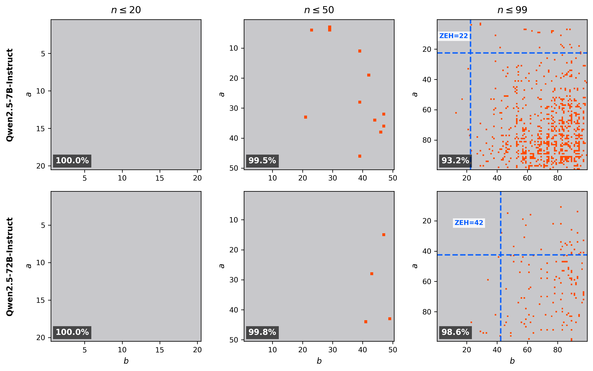

# Even GPT-5.2 Can't Count to Five: The Case for Zero-Error Horizons in Trustworthy LLMs

This repository contains the implementation and data for evaluating Zero-Error Horizon (ZEH) across language models. ZEH measures the largest problem size where a model answers **all** instances correctly, providing safety certificates for critical applications.

## Key Contributions

1. **ZEH Metric**: A scale-independent metric that avoids the arbitrariness of accuracy (which depends on chosen evaluation range)
2. **Surprising Failures**: Even GPT-5.2 fails at 5-bit parity
3. **Error Pattern Analysis**: Evidence that larger models shift from memorization to algorithmic computation, and ZEH can capture this trend
4. **FlashTree Acceleration**: Triton-based sparse tree attention for efficient exhaustive verification (10x speedup against auto-regressive decoding)

## Installation

```bash
uv sync
```

## Main Results

### ZEH Scaling (Qwen2.5 Series, Multiplication)

| Model        | ZEH | Accuracy (99×99) | ZEH Limiter                      |
| ------------ | --- | ---------------- | -------------------------------- |
| Qwen2.5-0.5B | 0   | 55.0%            | 1×1=1 (model answered 2)         |
| Qwen2.5-1.5B | 20  | 75.9%            | 1×21=21 (model answered 42)      |
| Qwen2.5-3B   | 15  | 79.3%            | 11×16=176 (model answered 186)   |
| Qwen2.5-7B   | 22  | 93.2%            | 4×23=92 (model answered 86)      |
| Qwen2.5-14B  | 26  | 97.1%            | 11×27=297 (model answered 303)   |
| Qwen2.5-32B  | 33  | 98.6%            | 34×29=986 (model answered 1006)  |
| Qwen2.5-72B  | 42  | 98.6%            | 28×43=1204 (model answered 1192) |

Note: ZEH Limiter is the smallest problem that determines ZEH (first failure).

Note (32B vs 72B): Accuracy can tie while Zero-Error Horizon differs sharply. Qwen2.5-32B and 72B have essentially identical 99x99 accuracy (32B is higher by 1/9801) on the full 99x99 grid, yet its Zero-Error Horizon is lower (33 vs 42) because Zero-Error Horizon is determined by the first failure, not the total error count. In other words, 72B has a larger verified safe region (all instances with n <= 42 are correct). Zero-Error Horizon exposes the size of the region where correctness is guaranteed, which is the relevant quantity in safety-critical settings.

Why this happens: small models tend to make more "random" errors scattered throughout the input space, while larger models make errors on more systematic cases (see Structured Errors and the carry-likely analysis below). Accuracy alone cannot distinguish "one extra error anywhere" from "an earlier worst-case failure," while Zero-Error Horizon can.

### GPT-5.2 ZEH (Multiple Tasks)

| Task                 | ZEH | ZEH Limiter                 | Expected | GPT-5.2's Answer |
| -------------------- | --- | --------------------------- | -------- | ---------------- |
| Multiplication       | 126 | `127*82=`                   | 10414    | 10314            |
| Parity               | 4   | `11000`                     | 0        | 1                |
| Balanced Parentheses | 10  | `((((())))))`               | No       | Yes              |
| Graph Coloring       | 4   | `{(1,2),(1,4),(1,5),(2,3)}` | 2        | 3                |

```bash
# Multiplication (ZEH=126, ZEH Limiter: 127*82)
curl -s https://api.openai.com/v1/responses \
  -H "Authorization: Bearer $OPENAI_API_KEY" \
  -H "Content-Type: application/json" \
  -d '{
    "model": "gpt-5.2-2025-12-11",
    "instructions": "Answer with only the integer.",
    "input": "127*82=",
    "temperature": 0
  }' \
  | jq -r '.output[0].content[0].text'
# Expected: 10414, GPT-5.2's answer: 10314

# Parity (ZEH=4, ZEH Limiter: 11000)
curl -s https://api.openai.com/v1/responses \
  -H "Authorization: Bearer $OPENAI_API_KEY" \
  -H "Content-Type: application/json" \
  -d '{
    "model": "gpt-5.2-2025-12-11",
    "instructions": "Compute the parity (XOR) of the binary string. Answer with only 0 or 1.",
    "input": "11000",
    "temperature": 0
  }' \
  | jq -r '.output[0].content[0].text'
# Expected: 0, GPT-5.2's answer: 1

# Parentheses (ZEH=10, ZEH Limiter: ((((())))))
curl -s https://api.openai.com/v1/responses \
  -H "Authorization: Bearer $OPENAI_API_KEY" \
  -H "Content-Type: application/json" \
  -d '{
    "model": "gpt-5.2-2025-12-11",
    "instructions": "Is the parentheses string balanced? Answer with only Yes or No.",
    "input": "((((())))))",
    "temperature": 0
  }' \
  | jq -r '.output[0].content[0].text'
# Expected: No, GPT-5.2's answer: Yes

# Graph Coloring (ZEH=4, ZEH Limiter: V=5, edges=(1,2),(1,4),(1,5),(2,3))
curl -s https://api.openai.com/v1/responses \
  -H "Authorization: Bearer $OPENAI_API_KEY" \
  -H "Content-Type: application/json" \
  -d '{
    "model": "gpt-5.2-2025-12-11",
    "instructions": "What is the chromatic number of this graph? Answer with only the integer.",
    "input": "Graph with 5 vertices and edges (1,2), (1,4), (1,5), (2,3).",
    "temperature": 0
  }' \
  | jq -r '.output[0].content[0].text'
# Expected: 2, GPT-5.2's answer: 3
```

Note: Strictly speaking, OpenAI's API is not fully deterministic even with temperature=0. If you get an unexpected answer, please try again.

### Key Findings

#### 1. Accuracy is Arbitrary

Two models can have identical accuracy at n≤20 but vastly different ZEH.



**Reproduce:**

```bash
uv run python scripts/visualize_zeh_vs_accuracy.py
```

#### 2. Frequency Independence

Smaller models show stronger correlation between training example frequency and accuracy, indicating memorization. Larger models show weaker correlation between training frequency and accuracy (ρ decreases from 0.2651 to 0.0374).

| Model                 | Spearman's ρ |
| --------------------- | ------------ |
| Qwen2.5-0.5B-Instruct | 0.2651       |
| Qwen2.5-1.5B-Instruct | 0.2000       |
| Qwen2.5-3B-Instruct   | 0.1872       |
| Qwen2.5-7B-Instruct   | 0.1147       |
| Qwen2.5-14B-Instruct  | 0.0683       |
| Qwen2.5-32B-Instruct  | 0.0353       |
| Qwen2.5-72B-Instruct  | 0.0374       |

These results suggest larger models rely less on memorization of frequent examples and more on algorithmic reasoning.

**Reproduce:**

```bash
uv run python scripts/analyze_frequency_correlation.py

# C4 corpus statistics:
#   Total documents: 364,507,498
#   Total matches: 48,536
#   Unique pairs: 2,194

# Model             Params   Accuracy   Spearman ρ      p-value
# ------------------------------------------------------------
# Qwen2.5-0.5B         0.5B     0.5498       0.2651    2.90e-157
# Qwen2.5-1.5B         1.5B     0.7592       0.2000     5.69e-89
# Qwen2.5-3B           3.0B     0.7927       0.1872     5.30e-78
# Qwen2.5-7B           7.0B     0.9318       0.1147     4.59e-30
# Qwen2.5-14B         14.0B     0.9707       0.0683     1.28e-11
# Qwen2.5-32B         32.0B     0.9857       0.0353     4.71e-04
# Qwen2.5-72B         72.0B     0.9856       0.0374     2.15e-04

# ------------------------------------------------------------
# Meta-correlation (log(params) vs Spearman ρ):
#   ρ = -0.9643, p = 0.000454
```

#### 3. Carry-like difficulty and structured errors

**Structured errors.** In the table below, we count an error as structured if the numeric discrepancy satisfies:

$$| \text{pred} - \text{gold} | \in \{10,20,\dots,100\}.$$

As models scale up, total errors drop sharply, but a larger fraction of the remaining errors become structured (multiples of 10 within 100), suggesting larger models fail in more systematic, arithmetic-looking ways rather than unstructured guessing.

| Model | Accuracy | Total Errors | Structured Errors | Structured Rate |
| ----- | -------- | ------------ | ----------------- | --------------- |
| 0.5B  | 55.0%    | 4412         | 2569              | 58%             |
| 1.5B  | 75.9%    | 2360         | 1838              | 78%             |
| 3B    | 79.3%    | 2032         | 1544              | 76%             |
| 7B    | 93.2%    | 668          | 562               | 84%             |
| 14B   | 97.1%    | 287          | 250               | 87%             |
| 32B   | 98.6%    | 140          | 121               | 86%             |
| 72B   | 98.6%    | 141          | 127               | **90%**         |

**Carry-Likely Errors (logistic regression).** Separately, we test whether _carry-likely_ problems remain relatively harder as scale increases, using

$$\text{correct} \sim \text{carry} + \log_{10}(\text{params}) + \text{carry}\times\log_{10}(\text{params}),$$

where `carry=1` iff some digit pair satisfies `da*db >= 10`. We find a significant **negative** interaction:

```
interaction coef = -0.3483,  χ² = 7.8810,  p = 0.004996
```

meaning that as models get larger, residual errors concentrate more on carry-likely instances.

These findings suggest that smaller models have more random errors, while larger models' errors are more structured and concentrated on carry-likely problems, indicating a shift from memorization to algorithmic reasoning.

**Reproduce:**

```bash
uv run python scripts/analyze_carry_errors.py

# ==========================================================================================
# Structured Error Statistics
# ==========================================================================================

# Model      Accuracy   TotalErr  StructuredErr    Other   StructuredRate
# ------------------------------------------------------------------------------------------
# 0.5B          55.0%       4412           2569     1843              58%
# 1.5B          75.9%       2360           1838      522              78%
# 3B            79.3%       2032           1544      488              76%
# 7B            93.2%        668            562      106              84%
# 14B           97.1%        287            250       37              87%
# 32B           98.6%        140            121       19              86%
# 72B           98.6%        141            127       14              90%

# ======================================================================
# Logistic Regression: correct ~ carry + log(params) + carry×log(params)
# ======================================================================

# Model without interaction:
#   carry coef: -0.5488
#   log_params coef: 1.4510

# Model with interaction:
#   carry coef: -0.5456
#   log_params coef: 1.7902
#   interaction coef: -0.3483

# Likelihood ratio test:
#   χ² = 7.8810, df = 1, p = 0.004996
```

#### 4. Prompt Stability

We evaluated ZEH across 5 different prompt templates to assess sensitivity.

| Model | baseline | compute | product | eval | answer | Mean | Std |
| ----- | -------- | ------- | ------- | ---- | ------ | ---- | --- |
| 0.5B  | 0        | 10      | 6       | 0    | 1      | 3.4  | 4.4 |
| 1.5B  | 20       | 16      | 10      | 16   | 14     | 15.2 | 3.6 |
| 3B    | 15       | 12      | 12      | 12   | 9      | 12.0 | 2.1 |
| 7B    | 22       | 22      | 22      | 21   | 22     | 21.8 | 0.4 |
| 14B   | 26       | 41      | 41      | 31   | 43     | 36.4 | 7.5 |
| 32B   | 33       | 46      | 33      | 33   | 33     | 35.6 | 5.8 |
| 72B   | 42       | 40      | 40      | 45   | 43     | 42.0 | 2.1 |

While absolute ZEH values varied, the overall scaling trend with model size remained consistent. This supports the heuristic that staying below the ZEH generally ensures reliable correctness, regardless of prompt phrasing and context. For example, the 7B model generally ensures correctness in `n ≤ 20`, 32B in `n ≤ 30`, and 72B in `n ≤ 40`.

Prompt templates used:

- **baseline**: `{a}*{b}=` (system: "Answer with only the integer.")
- **compute**: `Compute {a} × {b}` (system: "You are a calculator. Output only the result.")
- **product**: `What is the product of {a} and {b}?` (system: "Give only the numerical answer.")
- **eval**: `Evaluate: {a} * {b}` (system: "Evaluate and respond with just the number.")
- **answer**: `{a} × {b} = ?` (system: "Provide only the numerical answer.")

**Reproduce:**

```bash
uv run python scripts/eval_prompt_sensitivity.py --model Qwen/Qwen2.5-3B-Instruct

# ZEH range: 9 - 15
# ZEH mean: 12.0
# ZEH std: 2.1
```

## Reproducing Data Generation

### Full Grid Evaluation (99×99)

To regenerate all grid evaluation data:

```bash
uv run python scripts/eval_full_grid.py --model Qwen/Qwen2.5-3B-Instruct

# Expected output:
# Model: Qwen/Qwen2.5-3B-Instruct
# Accuracy: 0.7927 (7769/9801)
# ZEH: 15
# Errors: 2032

# Run for all models:
for size in 0.5B 1.5B 3B 7B 14B 32B 72B; do
    uv run python scripts/eval_full_grid.py --model Qwen/Qwen2.5-${size}-Instruct
done
```

### C4 Frequency Scanning

The frequency data was generated by scanning the entire C4 corpus (364M documents). This process takes approximately 40 hours on a single machine or 1-2 hours with 40-way parallelization.

See `data/c4_frequency_results.json` for pre-computed frequencies.

## FlashTree Technical Details

FlashTree accelerates verification using:

1. **Trie Structure**: Groups queries with common prefixes
2. **Sparse Attention**: Only attends to relevant positions using index tensors
3. **GQA-Native Kernel**: Handles grouped-query attention without KV replication
4. **Online Softmax**: Numerically stable computation in a single pass

Key files:

- `src/flashtree.py`: Triton kernel implementation
- `src/sdpatrie.py`: Trie data structure and SDPA baseline

## FlashTree Benchmark Scripts

Two scripts are provided to benchmark FlashTree performance:

### 1. `speedtest.py` - Verification Runtime Benchmark

Measures verification runtime across multiple methods on the 1–99 multiplication suite (9801 tasks).

**Methods compared:**

- **TF (Teacher Forcing)**: Standard batched verification with teacher forcing
- **TF + Prefill**: Teacher forcing with prompt prefilling (common prefix KV cache sharing)
- **Trie (SDPA)**: Trie structure with SDPA-based attention (dense 4D mask)
- **FlashTree**: Triton-based sparse tree attention (no explicit mask)

Note: Both Trie (SDPA) and FlashTree use teacher forcing and prompt prefilling as well.

**Usage:**

```bash
# Single model benchmark
uv run python scripts/speedtest.py --all
```

**Expected Results (Verification runtime in ms, 9801 tasks, on RTX 4090 GPU):**

| Model                 | TF            | TF + Prefill  | Trie (SDPA)   | FlashTree         |
| --------------------- | ------------- | ------------- | ------------- | ----------------- |
| Qwen2.5-0.5B-Instruct | 2812 (1.00x)  | 1532 (1.84x)  | 1419 (1.98x)  | **1037 (2.71x)**  |
| Qwen2.5-1.5B-Instruct | 7542 (1.00x)  | 3961 (1.90x)  | 3810 (1.98x)  | **2845 (2.65x)**  |
| Qwen2.5-3B-Instruct   | 14581 (1.00x) | 7311 (1.99x)  | 6638 (2.20x)  | **5001 (2.92x)**  |
| Qwen2.5-7B-Instruct   | 29852 (1.00x) | 15567 (1.92x) | 13323 (2.24x) | **11165 (2.67x)** |

Speedup is relative to TF (Teacher Forcing).

### 2. `e2e_speedtest.py` - End-to-End ZEH Evaluation

Measures end-to-end runtime for computing ZEH, comparing multiple methods.

**Methods compared:**

- **Naive**: Auto-regressive decoding (incremental)
- **Naive + LA**: Auto-regressive decoding with look ahead (batch multiple N's)
- **TF**: Teacher forcing (incremental)
- **TF + LA**: Teacher forcing with look ahead
- **Trie (SDPA)**: Trie with SDPA 4D mask (uses TF, LA, and prefilling)
- **FlashTree**: Triton kernel (uses TF, LA, and prefilling)

**Usage:**

```bash
uv run python scripts/e2e_speedtest.py --all
```

**Expected Results (End-to-end runtime in ms, on RTX 4090 GPU):**

| Model                 | Naive        | Naive + LA   | TF             | TF + LA      | Trie (SDPA)  | FlashTree        |
| --------------------- | ------------ | ------------ | -------------- | ------------ | ------------ | ---------------- |
| Qwen2.5-0.5B-Instruct | 46 (1.00x)   | 330 (0.14x)  | **29 (1.59x)** | 214 (0.21x)  | 124 (0.37x)  | 126 (0.37x)      |
| Qwen2.5-1.5B-Instruct | 3135 (1.00x) | 799 (3.92x)  | 1746 (1.80x)   | 647 (4.85x)  | 386 (8.12x)  | **339 (9.25x)**  |
| Qwen2.5-3B-Instruct   | 2657 (1.00x) | 625 (4.25x)  | 1446 (1.84x)   | 467 (5.69x)  | 256 (10.38x) | **234 (11.35x)** |
| Qwen2.5-7B-Instruct   | 4515 (1.00x) | 1825 (2.47x) | 2984 (1.51x)   | 1661 (2.72x) | 792 (5.70x)  | **733 (6.16x)**  |

Speedup is relative to Naive (auto-regressive decoding).

Note: For Qwen2.5-0.5B-Instruct, the end-to-end time is short because ZEH=0, meaning only one instance needs to be evaluated before finding an error. In this case, look ahead adds overhead rather than providing speedup.

## Citation

```bibtex
@article{sato2026even,
  title        = {Even GPT-5.2 Can't Count to Five: The Case for Zero-Error Horizons in Trustworthy LLMs},
  author       = {Ryoma Sato},
  journal      = {arXiv},
  volume       = {abs/2601.15714},
  year         = {2026},
  url          = {https://arxiv.org/abs/2601.15714},
}
```

## License

MIT License
